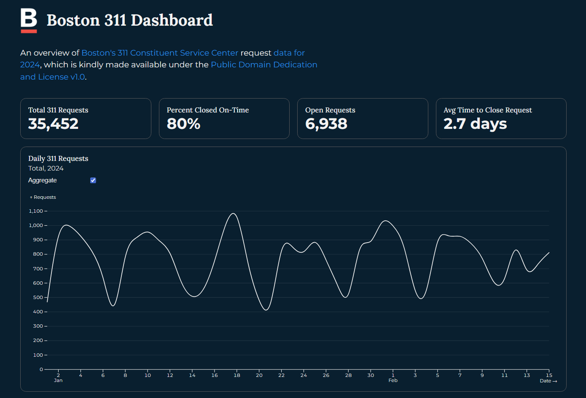

# Boston 311 Dashboard

This project pulls data from the City of Boston's Boston 311 datasets. Specifically, it pulls data from 2024 and creates a dashboard using Observable. 




## Credits

This is an [Observable Framework](https://observablehq.com/framework) project. To start the local preview server, run:

```
npm run dev
```

Then visit <http://localhost:3000> to preview your project.

For more, see <https://observablehq.com/framework/getting-started>.

